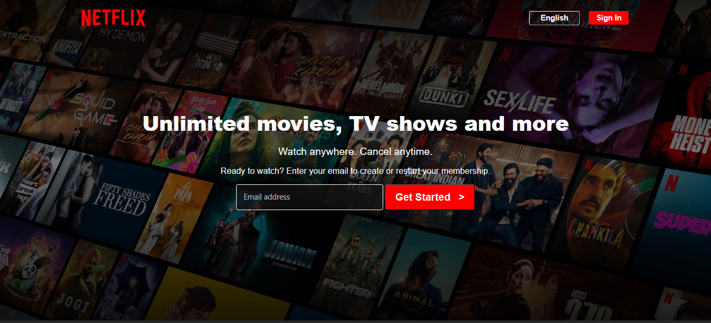
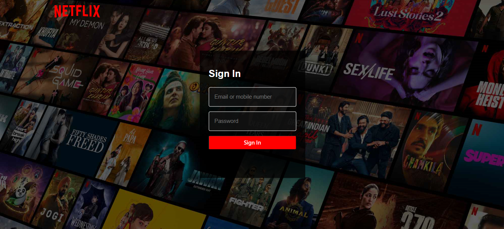
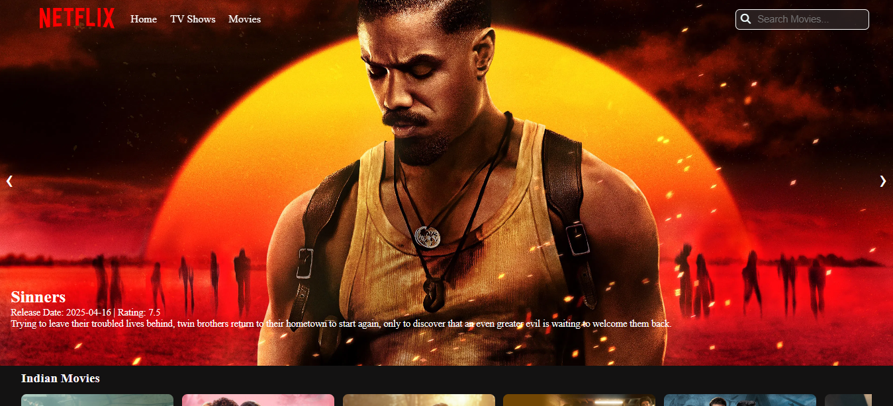
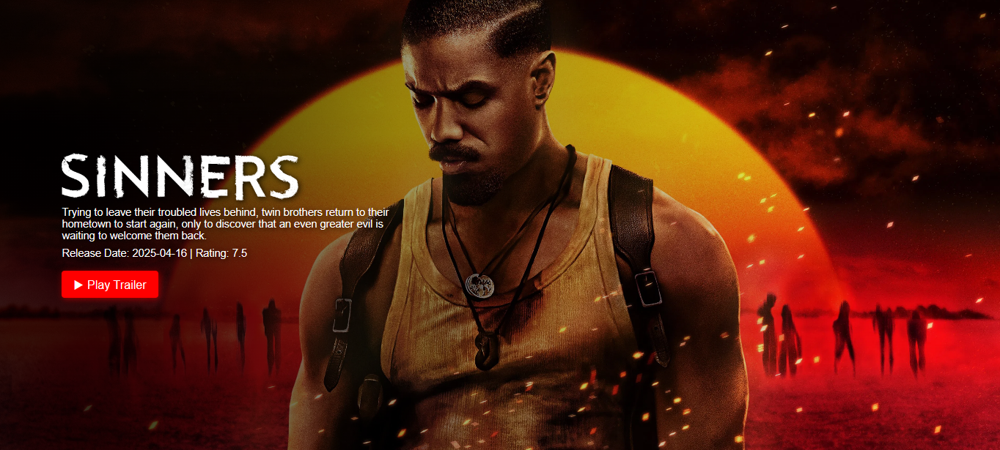

# PreviewPlay 🎬

🎬 PreviewPlay - Netflix-Inspired Streaming Website

PreviewPlay is a fully responsive, professional, and interactive frontend-based streaming website, inspired by Netflix. Designed with a strong focus on UI/UX, this project fetches and displays real-time movie data using the TMDB (The Movie Database) API. It showcases a modern landing page, hover effects, interactive carousels, movie detail views, and trailer previews – all built using HTML, CSS, and JavaScript.

## 🚀 Live Demo

🔗 [PreviewPlay Live](https://chaitanyakarthik01.github.io/PreviewPlay/) — *(GitHub Pages Deployment)*

💡 Features
🎞️ Movie categories carousel with TMDB API integration
🔍 Search functionality
🎥 Movie detail page with overview, rating and trailer
📱 Fully responsive across all devices
💻 Clean UI inspired by Netflix
🎨 Modern animations and hover effects

## 📸 Screenshots

 |
 |
 |
 |

